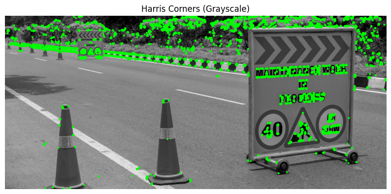

# Computer Vision Algorithms Implementation

This repository contains implementations of three computer vision algorithms for feature detection and matching:

1. SIFT (Scale-Invariant Feature Transform)
2. SURF (Speeded-Up Robust Features)
3. RANSAC (Random Sample Consensus) for outlier removal

## 1. SIFT Algorithm Implementation

The Scale-Invariant Feature Transform (SIFT) algorithm is used to detect and match keypoints between two images, regardless of scaling, rotation, or illumination changes.

### Results and Observations

**Observations:**
- The SIFT algorithm detected 6351 keypoints in the first image and 11683 in the second image.
- After applying the ratio test, 17 good matches were found between the two images.
- The algorithm successfully matched features despite differences in viewpoint and lighting.

## 2. SURF Algorithm Implementation

The Speeded-Up Robust Features (SURF) algorithm is a faster alternative to SIFT that also provides scale and rotation invariance.

### Results and Observations

**Observations:**
- With max features as 5000, 73 good matches were found between the images.
- SURF was noticeably faster than SIFT while maintaining good matching quality.

## 3. Harris Corner Detection
Harris Corner Detection is an algorithm used to detect corners within an image and is based on the idea that corners can be detected by looking for significant changes in intensity in all directions.

### Results and Observations

**Observations:**
- Succesfully detected the obstacles on the road.
- By decreasing blocksize, ksize and threshold the algorithm detected more features.

## Conclusion

These three computer vision algorithms are powerful tools for feature detection, matching, and geometric transformation estimation:

1. **SIFT** provides robust feature detection and matching between images that is invariant to scale, rotation, and illumination changes, but is computationally expensive.

2. **SURF** offers a faster alternative to SIFT with comparable accuracy, making it suitable for real-time applications where speed is important.

Both are used in computer vision applications such as image stitching, 3d reconstruction, image retrieval, etc.

3. **Harris Corner Detection** effectively detect corners within an image which can be used for Object Recognition and Tracking, Image Registration and Alignment, etc.

Each algorithm has its strengths and optimal use cases, and parameter tuning significantly affects their performance characteristics.
